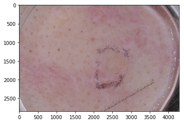
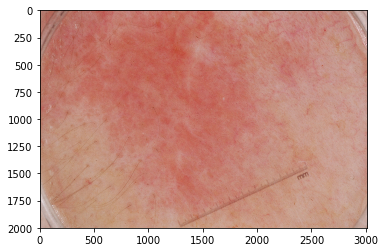
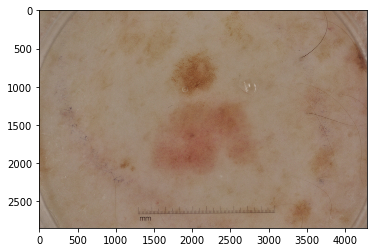
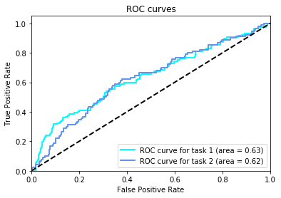
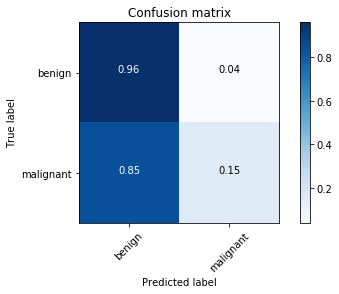

#  Skin Lesion Analysis Towards Melanoma Detection

---

This notebook describes the creation of a convolutinal neural network to diagnose melanoma based on images.

The data and objective are pulled from https://github.com/udacity/dermatologist-ai.

## Examine the data

Count the images and show some samples to make sure the images have been downloaded correctly.


```python
import numpy as np
from glob import glob

files = np.array(glob("./data/*/*/*"))
print('There are %d total images:' % len(files))
```

    There are 2750 total images:
    


```python
import matplotlib.pyplot as plt
import matplotlib.image as mpimg
%matplotlib inline                               

for i in range(3):
    img = mpimg.imread(files[i])
    plt.imshow(img)
    plt.show()
```











## Method to load the data

Create a method to load the data. It takes the image transformations as an input parameter. This allows to conveniently evaluate the effect of different image transformations on the model performance.


```python
import os
import torch
from torchvision import datasets
from torchvision import transforms

def get_data_loaders(data_dir, train_transform, test_transform, image_size, batch_size):
    train_dir = os.path.join(data_dir, 'train/')
    test_dir = os.path.join(data_dir, 'test/')
    validation_dir = os.path.join(data_dir, 'valid/')
    
    # Resize() seems to truncate images sometimes. Set LOAD_TRUNCATED_IMAGES to avoid OSError "image file is truncated"
    from PIL import ImageFile
    ImageFile.LOAD_TRUNCATED_IMAGES = True

    train_data = datasets.ImageFolder(train_dir, transform=train_transform)
    test_data = datasets.ImageFolder(test_dir, transform=test_transform)
    validation_data = datasets.ImageFolder(validation_dir, transform=test_transform)
    
    data = {
        "train": train_data,
        "test": test_data,
        "valid": validation_data
    }

    # print out some data stats
    print('Num training images: ', len(train_data))
    print('Num test images: ', len(test_data))
    print('Num validation images: ', len(validation_data))

    # define dataloader parameters
    num_workers = 0

    # prepare data loaders
    train_loader = torch.utils.data.DataLoader(train_data, batch_size=batch_size, 
                                               num_workers=num_workers, shuffle=True)
    test_loader = torch.utils.data.DataLoader(test_data, batch_size=batch_size, 
                                              num_workers=num_workers, shuffle=True)
    validation_loader = torch.utils.data.DataLoader(validation_data, batch_size=batch_size, 
                                                   num_workers=num_workers, shuffle=True)

    loaders = {
        "train": train_loader,
        "test": test_loader,
        "valid": validation_loader
    }
    
    # Visualize some images
    dataiter = iter(train_loader)
    images, labels = dataiter.next()
    images = images.numpy() # convert images to numpy for display
    fig = plt.figure(figsize=(25, 4))
    for idx in np.arange(int(batch_size / 2)):
        ax = fig.add_subplot(2, 20/2, idx+1, xticks=[], yticks=[])
        plt.imshow(np.transpose(images[idx], (1, 2, 0)).astype(np.uint8))
        
    print('\nNote: Normalization affects colors')

    return data, loaders
```

## Method for initializing the model

One popular technique to solve image classification problems is transfer learning. Transfer learning involves utilizing a pre-trained neural network and adapting it to a new dataset.

Pytorch provides a number of state-of-the-art pre-trained CNN models. One of them is [Inception v3](https://arxiv.org/abs/1512.00567), trained on the 1000-class Imagenet dataset. It has been applied successfully on classification of skin lesion, for example by [A. Esteva in 2017](https://www.nature.com/articles/nature21056.epdf?author_access_token=8oxIcYWf5UNrNpHsUHd2StRgN0jAjWel9jnR3ZoTv0NXpMHRAJy8Qn10ys2O4tuPakXos4UhQAFZ750CsBNMMsISFHIKinKDMKjShCpHIlYPYUHhNzkn6pSnOCt0Ftf6).


```python
import torchvision.models as models

print(models.inception_v3())
```

    Inception3(
      (Conv2d_1a_3x3): BasicConv2d(
        (conv): Conv2d(3, 32, kernel_size=(3, 3), stride=(2, 2), bias=False)
        (bn): BatchNorm2d(32, eps=0.001, momentum=0.1, affine=True, track_running_stats=True)
      )
      (Conv2d_2a_3x3): BasicConv2d(
        (conv): Conv2d(32, 32, kernel_size=(3, 3), stride=(1, 1), bias=False)
        (bn): BatchNorm2d(32, eps=0.001, momentum=0.1, affine=True, track_running_stats=True)
      )
      (Conv2d_2b_3x3): BasicConv2d(
        (conv): Conv2d(32, 64, kernel_size=(3, 3), stride=(1, 1), padding=(1, 1), bias=False)
        (bn): BatchNorm2d(64, eps=0.001, momentum=0.1, affine=True, track_running_stats=True)
      )
      (Conv2d_3b_1x1): BasicConv2d(
        (conv): Conv2d(64, 80, kernel_size=(1, 1), stride=(1, 1), bias=False)
        (bn): BatchNorm2d(80, eps=0.001, momentum=0.1, affine=True, track_running_stats=True)
      )
      (Conv2d_4a_3x3): BasicConv2d(
        (conv): Conv2d(80, 192, kernel_size=(3, 3), stride=(1, 1), bias=False)
        (bn): BatchNorm2d(192, eps=0.001, momentum=0.1, affine=True, track_running_stats=True)
      )
      (Mixed_5b): InceptionA(
        (branch1x1): BasicConv2d(
          (conv): Conv2d(192, 64, kernel_size=(1, 1), stride=(1, 1), bias=False)
          (bn): BatchNorm2d(64, eps=0.001, momentum=0.1, affine=True, track_running_stats=True)
        )
        (branch5x5_1): BasicConv2d(
          (conv): Conv2d(192, 48, kernel_size=(1, 1), stride=(1, 1), bias=False)
          (bn): BatchNorm2d(48, eps=0.001, momentum=0.1, affine=True, track_running_stats=True)
        )
        (branch5x5_2): BasicConv2d(
          (conv): Conv2d(48, 64, kernel_size=(5, 5), stride=(1, 1), padding=(2, 2), bias=False)
          (bn): BatchNorm2d(64, eps=0.001, momentum=0.1, affine=True, track_running_stats=True)
        )
        (branch3x3dbl_1): BasicConv2d(
          (conv): Conv2d(192, 64, kernel_size=(1, 1), stride=(1, 1), bias=False)
          (bn): BatchNorm2d(64, eps=0.001, momentum=0.1, affine=True, track_running_stats=True)
        )
        (branch3x3dbl_2): BasicConv2d(
          (conv): Conv2d(64, 96, kernel_size=(3, 3), stride=(1, 1), padding=(1, 1), bias=False)
          (bn): BatchNorm2d(96, eps=0.001, momentum=0.1, affine=True, track_running_stats=True)
        )
        (branch3x3dbl_3): BasicConv2d(
          (conv): Conv2d(96, 96, kernel_size=(3, 3), stride=(1, 1), padding=(1, 1), bias=False)
          (bn): BatchNorm2d(96, eps=0.001, momentum=0.1, affine=True, track_running_stats=True)
        )
        (branch_pool): BasicConv2d(
          (conv): Conv2d(192, 32, kernel_size=(1, 1), stride=(1, 1), bias=False)
          (bn): BatchNorm2d(32, eps=0.001, momentum=0.1, affine=True, track_running_stats=True)
        )
      )
      (Mixed_5c): InceptionA(
        (branch1x1): BasicConv2d(
          (conv): Conv2d(256, 64, kernel_size=(1, 1), stride=(1, 1), bias=False)
          (bn): BatchNorm2d(64, eps=0.001, momentum=0.1, affine=True, track_running_stats=True)
        )
        (branch5x5_1): BasicConv2d(
          (conv): Conv2d(256, 48, kernel_size=(1, 1), stride=(1, 1), bias=False)
          (bn): BatchNorm2d(48, eps=0.001, momentum=0.1, affine=True, track_running_stats=True)
        )
        (branch5x5_2): BasicConv2d(
          (conv): Conv2d(48, 64, kernel_size=(5, 5), stride=(1, 1), padding=(2, 2), bias=False)
          (bn): BatchNorm2d(64, eps=0.001, momentum=0.1, affine=True, track_running_stats=True)
        )
        (branch3x3dbl_1): BasicConv2d(
          (conv): Conv2d(256, 64, kernel_size=(1, 1), stride=(1, 1), bias=False)
          (bn): BatchNorm2d(64, eps=0.001, momentum=0.1, affine=True, track_running_stats=True)
        )
        (branch3x3dbl_2): BasicConv2d(
          (conv): Conv2d(64, 96, kernel_size=(3, 3), stride=(1, 1), padding=(1, 1), bias=False)
          (bn): BatchNorm2d(96, eps=0.001, momentum=0.1, affine=True, track_running_stats=True)
        )
        (branch3x3dbl_3): BasicConv2d(
          (conv): Conv2d(96, 96, kernel_size=(3, 3), stride=(1, 1), padding=(1, 1), bias=False)
          (bn): BatchNorm2d(96, eps=0.001, momentum=0.1, affine=True, track_running_stats=True)
        )
        (branch_pool): BasicConv2d(
          (conv): Conv2d(256, 64, kernel_size=(1, 1), stride=(1, 1), bias=False)
          (bn): BatchNorm2d(64, eps=0.001, momentum=0.1, affine=True, track_running_stats=True)
        )
      )
      (Mixed_5d): InceptionA(
        (branch1x1): BasicConv2d(
          (conv): Conv2d(288, 64, kernel_size=(1, 1), stride=(1, 1), bias=False)
          (bn): BatchNorm2d(64, eps=0.001, momentum=0.1, affine=True, track_running_stats=True)
        )
        (branch5x5_1): BasicConv2d(
          (conv): Conv2d(288, 48, kernel_size=(1, 1), stride=(1, 1), bias=False)
          (bn): BatchNorm2d(48, eps=0.001, momentum=0.1, affine=True, track_running_stats=True)
        )
        (branch5x5_2): BasicConv2d(
          (conv): Conv2d(48, 64, kernel_size=(5, 5), stride=(1, 1), padding=(2, 2), bias=False)
          (bn): BatchNorm2d(64, eps=0.001, momentum=0.1, affine=True, track_running_stats=True)
        )
        (branch3x3dbl_1): BasicConv2d(
          (conv): Conv2d(288, 64, kernel_size=(1, 1), stride=(1, 1), bias=False)
          (bn): BatchNorm2d(64, eps=0.001, momentum=0.1, affine=True, track_running_stats=True)
        )
        (branch3x3dbl_2): BasicConv2d(
          (conv): Conv2d(64, 96, kernel_size=(3, 3), stride=(1, 1), padding=(1, 1), bias=False)
          (bn): BatchNorm2d(96, eps=0.001, momentum=0.1, affine=True, track_running_stats=True)
        )
        (branch3x3dbl_3): BasicConv2d(
          (conv): Conv2d(96, 96, kernel_size=(3, 3), stride=(1, 1), padding=(1, 1), bias=False)
          (bn): BatchNorm2d(96, eps=0.001, momentum=0.1, affine=True, track_running_stats=True)
        )
        (branch_pool): BasicConv2d(
          (conv): Conv2d(288, 64, kernel_size=(1, 1), stride=(1, 1), bias=False)
          (bn): BatchNorm2d(64, eps=0.001, momentum=0.1, affine=True, track_running_stats=True)
        )
      )
      (Mixed_6a): InceptionB(
        (branch3x3): BasicConv2d(
          (conv): Conv2d(288, 384, kernel_size=(3, 3), stride=(2, 2), bias=False)
          (bn): BatchNorm2d(384, eps=0.001, momentum=0.1, affine=True, track_running_stats=True)
        )
        (branch3x3dbl_1): BasicConv2d(
          (conv): Conv2d(288, 64, kernel_size=(1, 1), stride=(1, 1), bias=False)
          (bn): BatchNorm2d(64, eps=0.001, momentum=0.1, affine=True, track_running_stats=True)
        )
        (branch3x3dbl_2): BasicConv2d(
          (conv): Conv2d(64, 96, kernel_size=(3, 3), stride=(1, 1), padding=(1, 1), bias=False)
          (bn): BatchNorm2d(96, eps=0.001, momentum=0.1, affine=True, track_running_stats=True)
        )
        (branch3x3dbl_3): BasicConv2d(
          (conv): Conv2d(96, 96, kernel_size=(3, 3), stride=(2, 2), bias=False)
          (bn): BatchNorm2d(96, eps=0.001, momentum=0.1, affine=True, track_running_stats=True)
        )
      )
      (Mixed_6b): InceptionC(
        (branch1x1): BasicConv2d(
          (conv): Conv2d(768, 192, kernel_size=(1, 1), stride=(1, 1), bias=False)
          (bn): BatchNorm2d(192, eps=0.001, momentum=0.1, affine=True, track_running_stats=True)
        )
        (branch7x7_1): BasicConv2d(
          (conv): Conv2d(768, 128, kernel_size=(1, 1), stride=(1, 1), bias=False)
          (bn): BatchNorm2d(128, eps=0.001, momentum=0.1, affine=True, track_running_stats=True)
        )
        (branch7x7_2): BasicConv2d(
          (conv): Conv2d(128, 128, kernel_size=(1, 7), stride=(1, 1), padding=(0, 3), bias=False)
          (bn): BatchNorm2d(128, eps=0.001, momentum=0.1, affine=True, track_running_stats=True)
        )
        (branch7x7_3): BasicConv2d(
          (conv): Conv2d(128, 192, kernel_size=(7, 1), stride=(1, 1), padding=(3, 0), bias=False)
          (bn): BatchNorm2d(192, eps=0.001, momentum=0.1, affine=True, track_running_stats=True)
        )
        (branch7x7dbl_1): BasicConv2d(
          (conv): Conv2d(768, 128, kernel_size=(1, 1), stride=(1, 1), bias=False)
          (bn): BatchNorm2d(128, eps=0.001, momentum=0.1, affine=True, track_running_stats=True)
        )
        (branch7x7dbl_2): BasicConv2d(
          (conv): Conv2d(128, 128, kernel_size=(7, 1), stride=(1, 1), padding=(3, 0), bias=False)
          (bn): BatchNorm2d(128, eps=0.001, momentum=0.1, affine=True, track_running_stats=True)
        )
        (branch7x7dbl_3): BasicConv2d(
          (conv): Conv2d(128, 128, kernel_size=(1, 7), stride=(1, 1), padding=(0, 3), bias=False)
          (bn): BatchNorm2d(128, eps=0.001, momentum=0.1, affine=True, track_running_stats=True)
        )
        (branch7x7dbl_4): BasicConv2d(
          (conv): Conv2d(128, 128, kernel_size=(7, 1), stride=(1, 1), padding=(3, 0), bias=False)
          (bn): BatchNorm2d(128, eps=0.001, momentum=0.1, affine=True, track_running_stats=True)
        )
        (branch7x7dbl_5): BasicConv2d(
          (conv): Conv2d(128, 192, kernel_size=(1, 7), stride=(1, 1), padding=(0, 3), bias=False)
          (bn): BatchNorm2d(192, eps=0.001, momentum=0.1, affine=True, track_running_stats=True)
        )
        (branch_pool): BasicConv2d(
          (conv): Conv2d(768, 192, kernel_size=(1, 1), stride=(1, 1), bias=False)
          (bn): BatchNorm2d(192, eps=0.001, momentum=0.1, affine=True, track_running_stats=True)
        )
      )
      (Mixed_6c): InceptionC(
        (branch1x1): BasicConv2d(
          (conv): Conv2d(768, 192, kernel_size=(1, 1), stride=(1, 1), bias=False)
          (bn): BatchNorm2d(192, eps=0.001, momentum=0.1, affine=True, track_running_stats=True)
        )
        (branch7x7_1): BasicConv2d(
          (conv): Conv2d(768, 160, kernel_size=(1, 1), stride=(1, 1), bias=False)
          (bn): BatchNorm2d(160, eps=0.001, momentum=0.1, affine=True, track_running_stats=True)
        )
        (branch7x7_2): BasicConv2d(
          (conv): Conv2d(160, 160, kernel_size=(1, 7), stride=(1, 1), padding=(0, 3), bias=False)
          (bn): BatchNorm2d(160, eps=0.001, momentum=0.1, affine=True, track_running_stats=True)
        )
        (branch7x7_3): BasicConv2d(
          (conv): Conv2d(160, 192, kernel_size=(7, 1), stride=(1, 1), padding=(3, 0), bias=False)
          (bn): BatchNorm2d(192, eps=0.001, momentum=0.1, affine=True, track_running_stats=True)
        )
        (branch7x7dbl_1): BasicConv2d(
          (conv): Conv2d(768, 160, kernel_size=(1, 1), stride=(1, 1), bias=False)
          (bn): BatchNorm2d(160, eps=0.001, momentum=0.1, affine=True, track_running_stats=True)
        )
        (branch7x7dbl_2): BasicConv2d(
          (conv): Conv2d(160, 160, kernel_size=(7, 1), stride=(1, 1), padding=(3, 0), bias=False)
          (bn): BatchNorm2d(160, eps=0.001, momentum=0.1, affine=True, track_running_stats=True)
        )
        (branch7x7dbl_3): BasicConv2d(
          (conv): Conv2d(160, 160, kernel_size=(1, 7), stride=(1, 1), padding=(0, 3), bias=False)
          (bn): BatchNorm2d(160, eps=0.001, momentum=0.1, affine=True, track_running_stats=True)
        )
        (branch7x7dbl_4): BasicConv2d(
          (conv): Conv2d(160, 160, kernel_size=(7, 1), stride=(1, 1), padding=(3, 0), bias=False)
          (bn): BatchNorm2d(160, eps=0.001, momentum=0.1, affine=True, track_running_stats=True)
        )
        (branch7x7dbl_5): BasicConv2d(
          (conv): Conv2d(160, 192, kernel_size=(1, 7), stride=(1, 1), padding=(0, 3), bias=False)
          (bn): BatchNorm2d(192, eps=0.001, momentum=0.1, affine=True, track_running_stats=True)
        )
        (branch_pool): BasicConv2d(
          (conv): Conv2d(768, 192, kernel_size=(1, 1), stride=(1, 1), bias=False)
          (bn): BatchNorm2d(192, eps=0.001, momentum=0.1, affine=True, track_running_stats=True)
        )
      )
      (Mixed_6d): InceptionC(
        (branch1x1): BasicConv2d(
          (conv): Conv2d(768, 192, kernel_size=(1, 1), stride=(1, 1), bias=False)
          (bn): BatchNorm2d(192, eps=0.001, momentum=0.1, affine=True, track_running_stats=True)
        )
        (branch7x7_1): BasicConv2d(
          (conv): Conv2d(768, 160, kernel_size=(1, 1), stride=(1, 1), bias=False)
          (bn): BatchNorm2d(160, eps=0.001, momentum=0.1, affine=True, track_running_stats=True)
        )
        (branch7x7_2): BasicConv2d(
          (conv): Conv2d(160, 160, kernel_size=(1, 7), stride=(1, 1), padding=(0, 3), bias=False)
          (bn): BatchNorm2d(160, eps=0.001, momentum=0.1, affine=True, track_running_stats=True)
        )
        (branch7x7_3): BasicConv2d(
          (conv): Conv2d(160, 192, kernel_size=(7, 1), stride=(1, 1), padding=(3, 0), bias=False)
          (bn): BatchNorm2d(192, eps=0.001, momentum=0.1, affine=True, track_running_stats=True)
        )
        (branch7x7dbl_1): BasicConv2d(
          (conv): Conv2d(768, 160, kernel_size=(1, 1), stride=(1, 1), bias=False)
          (bn): BatchNorm2d(160, eps=0.001, momentum=0.1, affine=True, track_running_stats=True)
        )
        (branch7x7dbl_2): BasicConv2d(
          (conv): Conv2d(160, 160, kernel_size=(7, 1), stride=(1, 1), padding=(3, 0), bias=False)
          (bn): BatchNorm2d(160, eps=0.001, momentum=0.1, affine=True, track_running_stats=True)
        )
        (branch7x7dbl_3): BasicConv2d(
          (conv): Conv2d(160, 160, kernel_size=(1, 7), stride=(1, 1), padding=(0, 3), bias=False)
          (bn): BatchNorm2d(160, eps=0.001, momentum=0.1, affine=True, track_running_stats=True)
        )
        (branch7x7dbl_4): BasicConv2d(
          (conv): Conv2d(160, 160, kernel_size=(7, 1), stride=(1, 1), padding=(3, 0), bias=False)
          (bn): BatchNorm2d(160, eps=0.001, momentum=0.1, affine=True, track_running_stats=True)
        )
        (branch7x7dbl_5): BasicConv2d(
          (conv): Conv2d(160, 192, kernel_size=(1, 7), stride=(1, 1), padding=(0, 3), bias=False)
          (bn): BatchNorm2d(192, eps=0.001, momentum=0.1, affine=True, track_running_stats=True)
        )
        (branch_pool): BasicConv2d(
          (conv): Conv2d(768, 192, kernel_size=(1, 1), stride=(1, 1), bias=False)
          (bn): BatchNorm2d(192, eps=0.001, momentum=0.1, affine=True, track_running_stats=True)
        )
      )
      (Mixed_6e): InceptionC(
        (branch1x1): BasicConv2d(
          (conv): Conv2d(768, 192, kernel_size=(1, 1), stride=(1, 1), bias=False)
          (bn): BatchNorm2d(192, eps=0.001, momentum=0.1, affine=True, track_running_stats=True)
        )
        (branch7x7_1): BasicConv2d(
          (conv): Conv2d(768, 192, kernel_size=(1, 1), stride=(1, 1), bias=False)
          (bn): BatchNorm2d(192, eps=0.001, momentum=0.1, affine=True, track_running_stats=True)
        )
        (branch7x7_2): BasicConv2d(
          (conv): Conv2d(192, 192, kernel_size=(1, 7), stride=(1, 1), padding=(0, 3), bias=False)
          (bn): BatchNorm2d(192, eps=0.001, momentum=0.1, affine=True, track_running_stats=True)
        )
        (branch7x7_3): BasicConv2d(
          (conv): Conv2d(192, 192, kernel_size=(7, 1), stride=(1, 1), padding=(3, 0), bias=False)
          (bn): BatchNorm2d(192, eps=0.001, momentum=0.1, affine=True, track_running_stats=True)
        )
        (branch7x7dbl_1): BasicConv2d(
          (conv): Conv2d(768, 192, kernel_size=(1, 1), stride=(1, 1), bias=False)
          (bn): BatchNorm2d(192, eps=0.001, momentum=0.1, affine=True, track_running_stats=True)
        )
        (branch7x7dbl_2): BasicConv2d(
          (conv): Conv2d(192, 192, kernel_size=(7, 1), stride=(1, 1), padding=(3, 0), bias=False)
          (bn): BatchNorm2d(192, eps=0.001, momentum=0.1, affine=True, track_running_stats=True)
        )
        (branch7x7dbl_3): BasicConv2d(
          (conv): Conv2d(192, 192, kernel_size=(1, 7), stride=(1, 1), padding=(0, 3), bias=False)
          (bn): BatchNorm2d(192, eps=0.001, momentum=0.1, affine=True, track_running_stats=True)
        )
        (branch7x7dbl_4): BasicConv2d(
          (conv): Conv2d(192, 192, kernel_size=(7, 1), stride=(1, 1), padding=(3, 0), bias=False)
          (bn): BatchNorm2d(192, eps=0.001, momentum=0.1, affine=True, track_running_stats=True)
        )
        (branch7x7dbl_5): BasicConv2d(
          (conv): Conv2d(192, 192, kernel_size=(1, 7), stride=(1, 1), padding=(0, 3), bias=False)
          (bn): BatchNorm2d(192, eps=0.001, momentum=0.1, affine=True, track_running_stats=True)
        )
        (branch_pool): BasicConv2d(
          (conv): Conv2d(768, 192, kernel_size=(1, 1), stride=(1, 1), bias=False)
          (bn): BatchNorm2d(192, eps=0.001, momentum=0.1, affine=True, track_running_stats=True)
        )
      )
      (AuxLogits): InceptionAux(
        (conv0): BasicConv2d(
          (conv): Conv2d(768, 128, kernel_size=(1, 1), stride=(1, 1), bias=False)
          (bn): BatchNorm2d(128, eps=0.001, momentum=0.1, affine=True, track_running_stats=True)
        )
        (conv1): BasicConv2d(
          (conv): Conv2d(128, 768, kernel_size=(5, 5), stride=(1, 1), bias=False)
          (bn): BatchNorm2d(768, eps=0.001, momentum=0.1, affine=True, track_running_stats=True)
        )
        (fc): Linear(in_features=768, out_features=1000, bias=True)
      )
      (Mixed_7a): InceptionD(
        (branch3x3_1): BasicConv2d(
          (conv): Conv2d(768, 192, kernel_size=(1, 1), stride=(1, 1), bias=False)
          (bn): BatchNorm2d(192, eps=0.001, momentum=0.1, affine=True, track_running_stats=True)
        )
        (branch3x3_2): BasicConv2d(
          (conv): Conv2d(192, 320, kernel_size=(3, 3), stride=(2, 2), bias=False)
          (bn): BatchNorm2d(320, eps=0.001, momentum=0.1, affine=True, track_running_stats=True)
        )
        (branch7x7x3_1): BasicConv2d(
          (conv): Conv2d(768, 192, kernel_size=(1, 1), stride=(1, 1), bias=False)
          (bn): BatchNorm2d(192, eps=0.001, momentum=0.1, affine=True, track_running_stats=True)
        )
        (branch7x7x3_2): BasicConv2d(
          (conv): Conv2d(192, 192, kernel_size=(1, 7), stride=(1, 1), padding=(0, 3), bias=False)
          (bn): BatchNorm2d(192, eps=0.001, momentum=0.1, affine=True, track_running_stats=True)
        )
        (branch7x7x3_3): BasicConv2d(
          (conv): Conv2d(192, 192, kernel_size=(7, 1), stride=(1, 1), padding=(3, 0), bias=False)
          (bn): BatchNorm2d(192, eps=0.001, momentum=0.1, affine=True, track_running_stats=True)
        )
        (branch7x7x3_4): BasicConv2d(
          (conv): Conv2d(192, 192, kernel_size=(3, 3), stride=(2, 2), bias=False)
          (bn): BatchNorm2d(192, eps=0.001, momentum=0.1, affine=True, track_running_stats=True)
        )
      )
      (Mixed_7b): InceptionE(
        (branch1x1): BasicConv2d(
          (conv): Conv2d(1280, 320, kernel_size=(1, 1), stride=(1, 1), bias=False)
          (bn): BatchNorm2d(320, eps=0.001, momentum=0.1, affine=True, track_running_stats=True)
        )
        (branch3x3_1): BasicConv2d(
          (conv): Conv2d(1280, 384, kernel_size=(1, 1), stride=(1, 1), bias=False)
          (bn): BatchNorm2d(384, eps=0.001, momentum=0.1, affine=True, track_running_stats=True)
        )
        (branch3x3_2a): BasicConv2d(
          (conv): Conv2d(384, 384, kernel_size=(1, 3), stride=(1, 1), padding=(0, 1), bias=False)
          (bn): BatchNorm2d(384, eps=0.001, momentum=0.1, affine=True, track_running_stats=True)
        )
        (branch3x3_2b): BasicConv2d(
          (conv): Conv2d(384, 384, kernel_size=(3, 1), stride=(1, 1), padding=(1, 0), bias=False)
          (bn): BatchNorm2d(384, eps=0.001, momentum=0.1, affine=True, track_running_stats=True)
        )
        (branch3x3dbl_1): BasicConv2d(
          (conv): Conv2d(1280, 448, kernel_size=(1, 1), stride=(1, 1), bias=False)
          (bn): BatchNorm2d(448, eps=0.001, momentum=0.1, affine=True, track_running_stats=True)
        )
        (branch3x3dbl_2): BasicConv2d(
          (conv): Conv2d(448, 384, kernel_size=(3, 3), stride=(1, 1), padding=(1, 1), bias=False)
          (bn): BatchNorm2d(384, eps=0.001, momentum=0.1, affine=True, track_running_stats=True)
        )
        (branch3x3dbl_3a): BasicConv2d(
          (conv): Conv2d(384, 384, kernel_size=(1, 3), stride=(1, 1), padding=(0, 1), bias=False)
          (bn): BatchNorm2d(384, eps=0.001, momentum=0.1, affine=True, track_running_stats=True)
        )
        (branch3x3dbl_3b): BasicConv2d(
          (conv): Conv2d(384, 384, kernel_size=(3, 1), stride=(1, 1), padding=(1, 0), bias=False)
          (bn): BatchNorm2d(384, eps=0.001, momentum=0.1, affine=True, track_running_stats=True)
        )
        (branch_pool): BasicConv2d(
          (conv): Conv2d(1280, 192, kernel_size=(1, 1), stride=(1, 1), bias=False)
          (bn): BatchNorm2d(192, eps=0.001, momentum=0.1, affine=True, track_running_stats=True)
        )
      )
      (Mixed_7c): InceptionE(
        (branch1x1): BasicConv2d(
          (conv): Conv2d(2048, 320, kernel_size=(1, 1), stride=(1, 1), bias=False)
          (bn): BatchNorm2d(320, eps=0.001, momentum=0.1, affine=True, track_running_stats=True)
        )
        (branch3x3_1): BasicConv2d(
          (conv): Conv2d(2048, 384, kernel_size=(1, 1), stride=(1, 1), bias=False)
          (bn): BatchNorm2d(384, eps=0.001, momentum=0.1, affine=True, track_running_stats=True)
        )
        (branch3x3_2a): BasicConv2d(
          (conv): Conv2d(384, 384, kernel_size=(1, 3), stride=(1, 1), padding=(0, 1), bias=False)
          (bn): BatchNorm2d(384, eps=0.001, momentum=0.1, affine=True, track_running_stats=True)
        )
        (branch3x3_2b): BasicConv2d(
          (conv): Conv2d(384, 384, kernel_size=(3, 1), stride=(1, 1), padding=(1, 0), bias=False)
          (bn): BatchNorm2d(384, eps=0.001, momentum=0.1, affine=True, track_running_stats=True)
        )
        (branch3x3dbl_1): BasicConv2d(
          (conv): Conv2d(2048, 448, kernel_size=(1, 1), stride=(1, 1), bias=False)
          (bn): BatchNorm2d(448, eps=0.001, momentum=0.1, affine=True, track_running_stats=True)
        )
        (branch3x3dbl_2): BasicConv2d(
          (conv): Conv2d(448, 384, kernel_size=(3, 3), stride=(1, 1), padding=(1, 1), bias=False)
          (bn): BatchNorm2d(384, eps=0.001, momentum=0.1, affine=True, track_running_stats=True)
        )
        (branch3x3dbl_3a): BasicConv2d(
          (conv): Conv2d(384, 384, kernel_size=(1, 3), stride=(1, 1), padding=(0, 1), bias=False)
          (bn): BatchNorm2d(384, eps=0.001, momentum=0.1, affine=True, track_running_stats=True)
        )
        (branch3x3dbl_3b): BasicConv2d(
          (conv): Conv2d(384, 384, kernel_size=(3, 1), stride=(1, 1), padding=(1, 0), bias=False)
          (bn): BatchNorm2d(384, eps=0.001, momentum=0.1, affine=True, track_running_stats=True)
        )
        (branch_pool): BasicConv2d(
          (conv): Conv2d(2048, 192, kernel_size=(1, 1), stride=(1, 1), bias=False)
          (bn): BatchNorm2d(192, eps=0.001, momentum=0.1, affine=True, track_running_stats=True)
        )
      )
      (fc): Linear(in_features=2048, out_features=1000, bias=True)
    )
    


```python
import torch.nn as nn
from collections import OrderedDict

def init_model(pretrained, freeze_weights, number_of_classes, use_cuda):
    # instantiate a pre-trained Inception v3 model
    model = models.inception_v3(pretrained=pretrained)

    # freeze the pre-trained layers
    if freeze_weights:
        for param in model.parameters():
            param.requires_grad = False

    # remove the last fully connected layer of the pre-trained network and
    # replace it by a new, randomly initialized layer
    n_inputs = model.fc.in_features
    model.fc = nn.Linear(n_inputs, number_of_classes)

    # move model to GPU if possible
    if use_cuda:
        model = model.cuda()
        
    return model
```

## Methods for training the model

I want to see the model performance while training the model. 

`%matplotlib notebook` provides a interactive graph. It can be used to show the current training loss and validation loss, for example.

I need a method to initialize such a graph and another method to update the graph.


```python
from IPython.display import clear_output
from matplotlib import pyplot as plt
import collections

def init_plot():
    fig,ax = plt.subplots(1,1)
    ax.grid(True)
    ax.set_xlabel('epoch')
    ax.legend(loc='center left') # the plot evolves to the right
    return fig, ax

def live_plot(fig, ax, data_dict, figsize=(7,5), title=''):
    if ax.lines:
        for line in ax.lines:
            line.set_xdata(list(range(len(data_dict[line.get_label()]))))
            line.set_ydata(data_dict[line.get_label()])
        ax.set_xlim(0, len(data_dict[line.get_label()]))
        
    else:
        for label,data in data_dict.items():
            line, = ax.plot(data)
            line.set_label(label)
            ax.legend()
        ax.set_ylim(0, max(data_dict.values())[0] + 0.5)
    
    fig.canvas.draw()
```


```python
import time
import pylab as pl
from IPython import display

def train(n_epochs, loaders, model, criterion, optimizer, scheduler, use_cuda, save_path):
    # initialize tracker for minimum validation loss
    valid_loss = 0.0
    valid_loss_min = np.Inf 
    
    losses = collections.defaultdict(list)
    fig,ax = init_plot()
    
    for epoch in range(1, n_epochs+1):
        epoch_start = time.time()
        
        scheduler.step(valid_loss)
        
        # initialize variables to monitor training and validation loss
        train_loss = 0.0
        valid_loss = 0.0
        
        ###################
        # train the model #
        ###################
        model.train()
        
        for batch_idx, (data, target) in enumerate(loaders['train']):
            # move to GPU
            if use_cuda:
                data, target = data.cuda(), target.cuda()
            
            ## find the loss and update the model parameters accordingly
            # clear gradients
            optimizer.zero_grad()
            
            # forward
            output = model(data)
            
            # The Inception model outputs two values: output from the last layer and the auxiliary logits.
            # Ignore the second output.
            if "Inception3" in str(type(model)):
                output = output[0]
            
            # calculate loss
            loss = criterion(output, target)
            
            # backward
            loss.backward()
            optimizer.step()
            
            ## record the average training loss, using something like
            train_loss += ((1 / (batch_idx + 1)) * (loss.data - train_loss))
            
            if batch_idx % 100 == 0:
                print('Epoch: {} Batch: {} \tTraining Loss: {:.6f}'.format(
                    epoch, 
                    batch_idx,
                    train_loss
                    ))
            
        ######################    
        # validate the model #
        ######################
        model.eval()
        
        for batch_idx, (data, target) in enumerate(loaders['valid']):
            # move to GPU
            if use_cuda:
                data, target = data.cuda(), target.cuda()
                
            ## update the average validation loss
            output = model(data)
            loss = criterion(output, target)
            
            valid_loss += ((1 / (batch_idx + 1)) * (loss.data - valid_loss))
        
        # plot losses
        if epoch > 1:
            losses["train"].append(train_loss.cpu())
            losses["valid"].append(valid_loss.cpu())
            live_plot(fig, ax, losses)
        
        # print training/validation statistics 
        print('Epoch: {} \t\tTraining Loss: {:.6f} \tValidation Loss: {:.6f} \tDuration: {:.6f} Min'.format(
            epoch, 
            train_loss,
            valid_loss,
            (time.time() - epoch_start) / 60.
            ))
        
        ## save the model if validation loss has decreased
        if valid_loss <= valid_loss_min:
            print("validation loss has decreased --> save the model")
            torch.save(model.state_dict(), save_path)
            valid_loss_min = valid_loss
    
    # return trained model
    return model
```

## Method for testing the model


```python
def test(loaders, model, criterion, use_cuda):
    # monitor test loss and accuracy
    test_loss = 0.
    correct = 0.
    total = 0.

    # set model into evaluation mode
    model.eval()
    
    for batch_idx, (data, target) in enumerate(loaders['test']):
        # move to GPU
        if use_cuda:
            data, target = data.cuda(), target.cuda()
            
        # forward pass: compute predicted outputs by passing inputs to the model
        output = model(data)
        
        # calculate the loss
        loss = criterion(output, target)
        
        # update average test loss 
        test_loss = test_loss + ((1 / (batch_idx + 1)) * (loss.data - test_loss))
        
        # convert output probabilities to predicted class
        pred = output.data.max(1, keepdim=True)[1]
        
        # compare predictions to true label
        correct += np.sum(np.squeeze(pred.eq(target.data.view_as(pred))).cpu().numpy())
        total += data.size(0)
            
    print('Test Loss: {:.6f}\n'.format(test_loss))

    print('\nTest Accuracy: %2d%% (%2d/%2d)' % (
        100. * correct / total, correct, total))
```

## Create, train and test a model

### Transfer learning approaches

There are different approaches to do transfer learning. If the the size of the new dataset is small, layers of the pre-trained model can be sliced off, the weights of the remaining layers frozen and a new fully connected layer can be added. This is also referred to as feature extraction. If the the size of the new dataset is large, the pre-trained model can be fine-tuned or re-trained - depending on the similarity of the new dataset to the original training data.

Because of the relatively small amount of training data, I will use feature extaction.

### Load the data


```python
%matplotlib inline             

image_size=299 # inception_v3 expects tensors with a size of N x 3 x 299 x 299

train_transform = transforms.Compose([transforms.RandomHorizontalFlip(p=0.5),
                                      transforms.RandomVerticalFlip(p=0.5),
                                      transforms.Resize(420),
                                      transforms.RandomRotation(359),
                                      transforms.CenterCrop(299),
                                      transforms.RandomResizedCrop((image_size, image_size)),
                                      transforms.ToTensor(),
                                      transforms.Normalize(mean=[0.485, 0.456, 0.406],
                                                           std=[0.229, 0.224, 0.225])
                                     ])

test_transform = transforms.Compose([transforms.Resize((image_size, image_size)),
                                     transforms.RandomResizedCrop((image_size, image_size)),
                                     transforms.ToTensor(),
                                     transforms.Normalize(mean=[0.485, 0.456, 0.406],
                                                          std=[0.229, 0.224, 0.225])])

data, loaders = get_data_loaders("data/", train_transform, test_transform, image_size, batch_size=20)
```

    Num training images:  2000
    Num test images:  600
    Num validation images:  150
    
    Note: Normalization affects colors
    


### Define parameters


```python
# Use cuda if available
use_cuda = torch.cuda.is_available()

# model parameters
number_of_classes = len(data["train"].classes) # 3 classes: melanoma, nevus and seborrheic_keratosis

# optimization algorithm parameters
learning_rate = 0.0025
epsilon = 0.1
weight_decay = 0.9
momentum = 0.9
scheduler_step_size = 8
decay_factor = 0.5

# training parameters
n_epochs = 30
```


```python
# some imports required later on
import torch.optim as optim
```


```python
%matplotlib notebook
```

### Feature extraction


```python
# instantiate a pre-trained Inception v3 model and freeze the pre-trained weights
model = init_model(pretrained=True, freeze_weights=True, number_of_classes=number_of_classes, use_cuda=use_cuda)
```


```python
criterion = nn.CrossEntropyLoss()
optimizer = optim.SGD(model.parameters(), lr=learning_rate, momentum=momentum)
scheduler = optim.lr_scheduler.ReduceLROnPlateau(optimizer, mode='min', factor=decay_factor, patience=scheduler_step_size)
```


```python
file_name = 'model_dermatologist_feature_extraction_v5.pt'
model = train(n_epochs, loaders, model, criterion, optimizer, scheduler, use_cuda, file_name)
```


    <IPython.core.display.Javascript object>


<img src="data:image/png;base64,iVBORw0KGgoAAAANSUhEUgAAAbAAAAEgCAYAAADVKCZpAAAgAElEQVR4nO2deXwT1732n970tnnb97a3t6X3tu+9lSFAWZMSsqfZ0zRb07QhW5v0pqU3bZb2Nl1im33NApgQlgCBEAIkYUkCwfKOLfbVGIzBYBazL8YQjMF4lZ73jyMZ2ZZkjS15Zs78vp/PfLCkYTRfjeY8OmfOOQMIgiAIgiAIgiAIgiAIgiAIgiAIgiAIgiAIgiAIgiAIgiAIgiAIgiAIgiAIgiAIgiAIgiAIgiAIgiAIgiAIgiAIgiAIgiAIgiAIgiAIgiAIgiAIgiAIgiAIgiAIgiAIgiAIgiAIgiAIgiAIgiAIgiAIgiAIgiAIgiAIgiAIgiAIgiAIgiAIgiAIgiAIgiAIgiAIgiAIgiAIgiAIgiAIgiAIgiAIgiAIgiAIgiAIgiAIgtARfPOb32T//v21X3r06GH6PoijeIqnPp4Ays0uvx1P9+7d6QQ8Ho/ZuxB3nOBIiqdu2NUTQL7Z5bfjkQDTByc4kuKpG3b1hASY+UiA6YMTHEnx1A27ekICzHwkwPTBCY6keOqGXT0hAWY+EmD64ARHUjytQF1dHUtLS1lcXNzupaCgICbbiddSWlrKurq6Fp8BJMDMRwJMH5zgSIqnFSgtLWV5eTl9Pl+7t1VZWRmDPYoPPp+P5eXlLC0tbfEaJMDMRwJMH5zgSIqnFSguLo5JeJHWDjBShVhxcXGL5yEBZj4SYPrgBEdSPK1AqAK9rVg9wMjQvpAAMx8JMH1wgiMpnlbAbgH29a9/nSR5/PhxPvbYYyHXueOOO7hly5aQr0mAWRQJMH1wgiMpnlbArgEWCQkwGyIBpg9OcCTF0wqYHWCvvvoqp02b1vh4+PDhHDFiBO+++27269ePffr04bJlyxpfDwTYwYMH2bt3b5LkpUuX+OSTT7Jv37584okneMMNN0iA2Q0JMH1wgiMpnlYguEAfsXwnn5ixvs3LY9PWtHhuxPKdEd+/oKCAt99+e+Pjnj178vDhwzx//jxJsry8nFdddVVjR5NQAZaSksLf/va3JMnCwkJeccUVEmBxZA6A0wB2trLe9QC8AAZEs1EJMH1wgiMpnlbA7AAjyR49evD48ePcvn07b7nlFtbV1fGll15i3759ec011/DKK6/kyZMnSYYOsJ///OfMzc1t3F6/fv0kwOLI7QCuReQAuwJAHoB0SIA1wcqFQaxwgiMpnlbA7CZEkhwyZAjffvttJicnc/LkyXz//ff5xBNPNA46drlcPHjwIMnwAZaXl9e4PQmw+JOAyAH2FwAvAZgLCbAmWLkwiBVOcCTF0wpYIcB27tzJm2++md26deOJEyc4adIkvvzyyyTJvLw8AogYYCkpKRw4cCBJsqioSJoQO4AEhA+w/wdgFVQtbC4kwJpg5cIgVjjBkRRPK2CFACPJPn368M477ySprnvddNNN7N+/PwcOHMgePXpEDLDgThzPPvssb775ZgmwOJOA8AG2BMBN/r/nInKAPQ/14ed36tSJHo9H+yU1NdX0fRBH8dTFs6CggJWVlTFZzp07F7NtxWspKCho8RlAAswwCQgfYAcBHPIvF6E6fDza2galBqYPTnAkxdMKWKUG1lFIDSw2JKD1XoiANCG2wMqFQaxwgiMpnlZAAkwCzCgfAzgJoB7AMQADAfzRvzRnLiTAmmDlwiBWOMGRFE8rIAEmAWYJJMD0wQmOpHhaAQkwCTBLIAGmD05wJMXTCkiASYBZAgkwfXCCIymeVkACTALMEkiA6YMTHEnxtAJmB9i5c+eaTOYbLQ888ADPnTtn+P9JgFkUCTB9cIIjKZ5WwOwACx6QHExDQ0MsdqkFEmAWRQJMH5zgSIqnFTA7wJ588kleeeWVvOaaa3jdddfxzjvv5NNPP82ePXuSVPMcXnvttezVqxdnzpzZ+P9cLhfLy8t58OBB9ujRg7///e/Zq1cv/uQnP+GlS5fCvp8EmEWRANMHJziS4mkFmhTo6YnknAfbvNTPuq/l8+mJEd8/uAbm8Xj4ta99jaWlpY2vnz17lqSaLqp37948c+YMyaYBdsUVV3Dbtm0kyccff5zz58+PztcPJMDMRwJMH5zgSIqnFbBagAXmQwwwfPhwXn311bz66qv5jW98gxs2bCDZNMC6du3auP4bb7zB0aNHR+frBxJg5iMBpg9OcCTF0wqY3YTYPMAeeuihxtc8Hg9vvfVWVlVVkSTvuOOOxs8yOMCCr6GNHz+ew4cPD/t+EmAWRQJMH5zgSIqnFTA7wM6cOcMf/OAHJFsG2LJly/jwww+TJHfv3s2vfvWrEmC6IgGmD05wJMXTCpgdYCT59NNPs3fv3rzuuuuaBFhNTQ3vv/9+9u3blwMGDJAamM5IgOmDExxJ8bQCVgiwjkQCzKJIgOmDExxJ8bQCEmASYJZAAkwfnOBIiqcVkACTALMEEmD64ARHUjytgASYBJglkADTByc4kuJpBYqLi+nz+WKyLasHmM/nkwCzKhJg+uAER1I8rUBpaSnLy8tjEmJWDjCfz8fy8vIms3wEgASY+UQbYA1eHz/ffpzVdfGZLDPeWLkwiBVOcCTF0wrU1dWxtLSUxcXF7V4KCgpisp14LaWlpayrq2vxGUACzHyiDbC0HSfoSnTz7RV7Y30udAhWLgxihRMcSfHUDbt6QgLMfKINsIFzt9CV6GafYZk8V1Ub569G7LHrSWIEJziS4qkbdvWEBJj5RBNgZy7U8KrkNP72/c1MSHLzzYzdHfD1iC12PUmMYBXHlOwSvvTh1rht3yqe8UY8rQ0kwAwxB8BpADvDvP5rADv8y3oA10Sz0WgCbO66g3Qlull84jz/9FEBewzJYPmFmg74isQOu54kRrCK44/fzGXnJDfPV7e8bhALrOIZb8TT2kACzBC3A7gW4QPsFgDf8v/9AIBN0Ww0mgB7ZOpa3j9pNUnywOkL7Jzk5sjlu+L9/Ygpdj1JjGAFx+PnLtGV6KYr0c0Vxafi8h5W8OwIxNPaQALMMAkIH2DBfAvA8Wg22FqA7T99ga5EN99ddaDxub8v3s5ug9N5oiL8HUythl1PEiNYwXFpwbHGABuVGp8fOVbw7AjE09pAAswwCYguwP4OYHY0G2wtwMZn7mHnJDfLzlc3PnfkbBW7DkrjoM92xPs7EjPsepIYwQqOSZ8Wss/wTD4xYz0f8NfaY40VPDsC8bQ2kAAzTAJaD7C7AOwG8O0I6zwP9eHnd+rUiR6PJ+SSm5fHa4en8aHxGS1e++20THZJcnNRWm7Y/2+lJTU11fR9cILjjaPS+MiEDL4yO4uuRDdTs/K09OyIRTytvUACzDAJiBxgVwM4AKB7tBuMVAPbcOAMXYluLi041uK1U+er2X1wOv+6aHs8f+TEDI/HY/YuxB2zHcsqq+lKdHPGyv3MP3SWrkQ3M4pOxPx9zPbsKMTT2kACzDAJCB9gPwCwH6ozR9RECrBXlxSy59AMVtXWh3x9jHsXOye5ua/sQry+IzHDrieJEcx2dBeqwe4Fh79gXYOXPYdmcOiyopi/j9meHYV4WhtIgBniYwAnAdQDOAZgIIA/+hdAXfM6B2C7f4nqww0XYNV1DewzLDNiDevMhRr2GprBF+M45idW2PUkMYLZjkOXFbHn0AzWNXhJkr95bxPvTVkZ8/cx27OjEE9rE20ZK8SRcAG2fPtxuhLdXLuvPOJBnJC1h65EN3cdPx+P70jMsMJJUlFVx0VbjsRsFu/mmO3407dW8ZnZGxsfT1+5n65EN8sqqyP8L+OY7dlRiKe1gQSY+YQLsN++v5k3jl3BBm/kwrbiUh37Ds/kwLmb4/EdiRlWOEkCYb967+m4bN9Mx3NVtXQlujkl9/JcmYVHz9GV6Obn24/H9L2scCw7AvG0NpAAM59QAVZ+oYZdktP4enp0U0ZNyd3beO3DqljhJLk3ZSVdiW4+P29LXLZvpmPWzpN0Jbq5qfRs43MNXh/7DM9k0qeFMX0vKxzLjkA8rQ0kwMwnVIC9t6aUrkQ3S05Fd5+eizX17Dcqu0nzkdUw+yQJDAi/6bUV7JKcxpMVsW1WI811HJ26i90Gp7OmvuntdgbO3cI7xuXF9L3MPpYdhXhaG0iAmU+oAHt48ho++LaxQaizVh+gK9HNDQfOxOr7EVPMPkmmefbRlejmxgNnmJDk5ls5JTF/DzMdH568hk/MWN/i+dn+H0PHz8Vu1hazj2VHIZ7WBhJg5tM8wPaeqqQr0c3Za1regTQS1XUNvGFsDgdMXxe3TgrtweyT5JEpa/jI1LUkVe+8G8euYL2/t16sMMuxsrqOnZPcTMna0+K14hPn6Up085P8ozF5r+Xbj/OZyZmW/I5FoqKqjiuKTxnab7O/sx2FXT0hAWY+zQPsjYzd7JKcxtOVxmebn7fhEF2Jbq4siU8nhfZg5klyzD/B7Tue/STJ7F2n/IN8T8b0fcxyzNtTFrbHqtfr449GZsVkwLvP5+NdEzxR9Y61EhWX6vjg26sNB7ldC3aj2NUTEmDmExxgXq+PN7+2gv89Z1ObDmhtvZe3vpHLn01ZY5lfyD6fj2/llHDe8lzT9mHOWtWMduC0GvDd4P+cY33N0KyC4I2M3bwqOS3sgPcXFuTzltdz2/2d2Hr4i8aJgq18vTWYizX1fHTaWnYdlMa7Jnh49YisqH8c2rVgN4pdPSEBZj7BAbZuf3m7uz0v3nKErkQ3M3fGtnbRVnJ3q9rO/W+mm7YPT85cz/smrmry3OQVqudmafnFmL2PWQXBL6at5S+mrQ37+rz16n5yh860z3XQZzv4wyHpfGmmmmex6FhFu7YXb6rrGvjUzA3skpzGjKKT3FdWyW6D0vnigugG/tu1YDeKXT0hAWY+wQH2t8Xb2XtYJqvrGiIctsjUN3h513gP75u4qtUxZB3BgOnrmJCkfrXnH+r4bv5nLtSEvD5Udr6aVyWncYw7drccMaMguFTbwKtaGXKxr0z1wPx40+E2v091XQP7Ds/k/35cQHd2HnsPy+TLHxW0eXvxprbey+fmbGJCUtO5RKfm7Yu6+diuBbtR7OoJCTDzCQTYpdoG9hqawb8vbv+1is/9s3gs29ZyEuCOZPNBNaHs1Lx97D3Ezd+93/GDrRduPkxXops7j7esLbywIJ/XjMxq1w+GYMwoCNbuU7X2vD1lYdfx+Xy8bkwO/9SOwEktVN+pNXvL6fF4+FpaMTsnuXnkbFWbtxkv6hu8/OP8fLoS3fyoWWjXNXj5wKTVvG5MDiuqIt+x2q4Fu1Hs6gkJMPMJBNiybepGhOv3t78bvNfr40/fWsUfjcyKeUcFI/z2/c3sNyqbl2ob+JdZWaZMefXcnE388Zuhr/+s8xf+n26NTQ89MwqClOwSdk5ys7I6cmH8548LeN2YnDZfB3tuzibe9JqaGcbj8fBkRTW7DkqLy2TB7cHr9fGVhdsi9uQtOlbBLslprf5YtGPBvv/0BcMTGtjRk5QAswSBAPvNe5t4y+u59Mao2e/A6Qt8ePIauhLd/MvCba3+2ow1ge7bk1eoqY3MaHaqrK5jt0HpYZsJA73qIl0/MoIZBcGTM9fz4clrWl3v402qJrqvLLrB8cGUna9m5yQ3x2WqZsqA5z+WbOcPh6TzzAXjPWbjgc/nY/JnO1pMqRWKNzJ2tzqtmN0K9sVbjrD74HS6Et0csXxn1C0LdvMMAAkw8+nevTvLKlUB8WZGdFNHRUtdg5dv5ZTwquQ03jh2RYd2r//zxwXsNTSjMTg9Hg9fT9/Nzkmx7TgRiUBTav6hs2HXCQz0jUXNsKMLgpr6BnYfnM5Rqa1fxzt8poquRDfnrT9o+H1mrlKTAu/39+IMeO4rU2MWU7JjPyjcKD6fj6NTd9GVGN15VF3XwLvGe3jL67m8WBO696ZdCvbqugYmflJIV6KbT7+7gUOXFdGV6Oa9KStDNp03xy6ezYEEmPl07969cRaNtvw6joYdRysa5wFM/mxH2BM2Vhw+U8XOSW6OTStufM7j8fB0ZQ27D07nq0tiOzdfOF5csJXXjcmJWKs9V1XL7oPTmfzZjna/X0cXBIFrjFlR9Dj1+Xy85fVc/nF+vqH38Pl8/MnElXw0qJYa7Pn7D7bwmpFZYbvwdxQp2SV0Jbo5/POdUTeTbj54lglJ6v+Ewg4F++EzVY1j3MZl7m7suLWy5DSvH5PDroPS+I5nf8QOXXbwDAUkwMyne/fufGDSav5sSuvNQO2huq6Br6UVMyHJzdvezGsy6WusGbx0B7sNSuep85fnGwycJEOXFbHroLSYTm0Uiuq6BvYcmsFBUQTT3xZvZ8+hGa1eR2qNji4IApM4f3GxNqr1/7Z4O380MstQM/WOoxV0Jbq5YOOhxueCPfMPqbFh7xmcOSaWBG4b8+qSQsNN8MOWFTEhKXQt3eoF+4riU+w7PJN9h2cyZ9epFq9/cbGWLyxQnVken74+bIcbq3uGAxJg5tO5a3e6Et2cs7ZjCoDNB8/ytjfzmJDk5hj3rpj1wAtQVlnNboPTW8yAHjhJjn5RxauS08L+6o0Vgdk2orl1yrYj6rYj8zYcanXdSHR0QfDM7I386VurWl/Rzyf5Rw03lw5bVsRug9NZcelyuDf3HDB9HW95PbfxRpodyQf+MW5/+qigTcNGLtbU85bXc3n3BE+Lc8GqBXuD18dxmeoa3oNvr+bhM+F7gvp8Pn6Sf5S9h2Wy97BMfpJ/tEUN1aqerQEJMPPp9INu7JKcxvIOvBB+saaeg5eqi933pKxk4dFzMdt2uOtcwSfJ3xari//xdP7rou3sOzwzqkLV5/Pxocmr+dO3VrVrtoqOLAjqGrzsOTTDUC/A4/4ptaKdZ7OmvoHXjMziS83u+N3cc0Wx+rHwWUFsenNGg8/n44cbVceU33+wpV3huarkNF2Jbo7PbDpW0IoFe/mFGv5q1obGGme0P0CPnK3igOnr6Ep084UF+U1q7ZE8z1fXcc3eck7J3cvfvb+ZL39UELfz1ui5Bwkw8/k/3+tqyvgoUp24N45VtxdJyS5p9y/o89V17DMsky9+2HKmg+CTZP/pC0wI6tUWa+oavLxmZBZfWbQt6v8T6KW35WDbm1Y7ssAL1BpTC43N2nLHuLyob36aUXQi5Biz5p5er4/3pqxs9w+AaPB6fczcebKxh+0zsze2uIVMW/jb4u3skpzWpNOD1QIs/9BZ3jh2BbsPTueiLUcM//8Gr4/TPPvYdVAarx+Tw1X+Tl0Bzwavj8UnzvPDjYf5jyXbeW/KysZJCFyJbt41wcMfDknnjWNXxPTegz6fjws2HuKA6etYWx99GQQJMPP5yn90NVwIxZKKS3WN42ZeWbitXQVQYJaDUFMMNS8MXlywlX2GZTZpmooVgcG9RqbTqqqtZ59haqaJttKRBd4M/3Wfskpj9zVL+nQH+wzLjGom/oFzt/D6MTkt1g3lucTfPBlpQHV7aPD6uGzbMf5kouqMdMe4PC7afCRmzZbnqmrZf3QOH3x7daNvPI6n1+tjStYePvveJr66pJBv5ZRw4ebDXFVymntPVfJCiA5WPp+Pc9aW8qrkNN72Zl5UPQsjUXSsgvcEdep6YUYWn5y5nj2HZjSG1TUjs/jcnE2clLOXq0pON/Ym3nm8gj9+M5fdBqXzw42H2/2Dpayyms/N2dT4YyTa67mkBJhR5gA4DWBnmNe/BGAygP0AdgC4NpqNXvkfXWN+HaotBOYGbN6MEi3VdQ3sPzqbz74XeiLi5oVB0bGKxlk6Ys2QpUXsMSSDl2qNfa7DlhWx26C2j2vqyAD73fubedd44+8XGFqw/UjkZuPyCzW8KjmNrwX1JA0QyrO23subXlsR8p5k7aGuwctFW47wzvGexq7hy7Ydi/mtcMjLNc5pHvWdjPXxbPD6+LfF2+lKdPMnE1fyujE5jYERvPQZlsmfTFzJZ9/bxMRPCvm79zfTlejmwLlbYvaDr7qugcM/30lXoptdktx8ZMoaDltWxKUFx3iw/GLEYDpXVctn31Oh848l29tcfmUUneSPRmax++B0vr+21HAHHEiAGeJ2qFAKF2APAsiACrKbAGyKZqPf+UG3Nh38WOPz+RrHkny40ficeYEJY8PdUDNUYfDcnE2NM3XECq/Xx+vH5BjuLk6SJf57sU1fud/w/y2rrOboBdkdMv9kg9fHPsMzW3SUiYbTlTVROc6OcFfwcAV7YDhILJqXqusaOG/DId7yem5jZ4WMohMxG+gfjj/Oz2e3wencf/pCTAOsvsHLP39cQFeiuplqICBq6708craKm0rPctm2Y5y+cj+HLSvi7z/Ywocnr2H/0dn84ZB0vuPZHxf3svPVzFph/I7dDV4fJ2TtoSvRzZ9NWcNjBnoVV1bX8e/+IH9o8mrujfLO882BBJhhEhA+wGYCeDrocQmA77W2wVB3ZDaL+gYv/3vOJnZJTmPe7uibguob1G1cHp22Nuwvt1CFwRb/OKZY9sAMdOtu6zyQj89Yz9vezIu6sPB6fZy34RD7DM+kK9HN5e24k0C07Dxe0a5OE/emrAxbUw4QaWhHuIL9Qk09+w7P5B/mGf/xEKCqtp6zVh/g9f7ayaPT1jJvd1mH3R6orLKaV4/I4oDp65ibZ7xgD0Vdg7exO3ugdmeEeLu3J6izdp5kn2GZ7DcqO6p7xG0qPctb38hl5yTV2mPkmldzIAFmmASEDzA3gB8HPc4FcF1rG7RSgJGqh+JDk1ezx5CMqHsnLi1Q8zhmhxiLEiDcSfL4jPW86bUV7foiB/NaWjG7Dkrj+TaO6Qo0sUUza8mu4+f586lrG2dA6Dc8rdVgiAXv+WtHbR1LN2yZamIN95nvOq6mAZu77mDI1yMVeOMz9zAh6fKsHdFS3+DlnLWl7Dcqm65EN5+auYHr9pWbcl+7wPW8l2dmtbupsqa+gQPnbqEr0c1Zqw/EaA9jS3trmgdOX+C9KSvZOUnV7EMds5r6Br6evrtxHGqk2XGiBRJghklA+ABLQ8sA6x9m3eehPvz8Tp060ePxWGpZmpnLa4ense9QNxen5UZcNzcvj7eOTuPNo9OYm5cXdr3U1NSQz09Zon5pj5if3e79zsvL4/Uj0/jw+Iw2byMnN499hrr5aEr4bWTm5PEP07PYOcnNPkPdHPthDvPy8viHqalMSHTzk/TIn1l7l19OzGD/EWlt/v/jP1af+bufrQj5+vPvZLJLkpupWaGPZ7hj6fF4uCwzj1clu/mbKZlR78/0T1fw1tFpdCW6+cC49LD71VFLXl4en5ykOjTcNiad7y1t2/5krcjjw+PVdoZ80P7vd7yWSMcz2iUjJ48D3lKuj03MYHrO5e/O/OW5/PEYNUfjs1MymZETvpwwskACzDAJ0LgJMZh9ZZW8ekQW75rgidgzKDAGqLUZ3T0eT8jnfT4fH568hneMy2v39aPABMLNb6FhlDcy1Fi2UDWcFcWnGq/LJH1ayHNVlz+bRWm5TSYwjgc+n4/9RmXzr4vaftudLy7WMiHJzbdD7Gddg5fXjsqO2AwY7lgGGPSZmoml7HzkHpInKi7x5Y/UdaFbXs9lRtFJS91JfNzHObxhbA4TktwcvHSHoQ4UVbX1/NWsDUxIat992DqC1o5ntPh8Pr676gA7J6nxpfvKKjlr9QF2G5TOa0dlR2yhaQuQADNMAsIH2ENo2oljczQbtGqAkaq9utvgdD72zrqQPY18Ph9/+U50szBEOkkCvb/acydqkpyYXcKEJHe7B1oeOVvFhGY3wTxRcYl/mJff2INsc4jxYh6Ph0/ONHYNzSh7/R1NFm02Pg4omAcmreZTMze0eD7HP4NJqKmJArRW4B0sv8jOSe6wN9msqW/gO5797Dk0g90GpzMluySmHXlihcfjYWV1HUcu38XOSW72H53DZduOtRqyF2rq+fj09eycFLtb9cSTWAVYgHX7ytlvVHbjGLKBc7fEZfAzJMAM8TGAkwDqARwDMBDAH/0LoIJrGoADAIoQxfUvwNoBRl6+keGLC7a2KJQ3lZ6NeK0kmEgnidfr4z0xGAj707dW8fEYdeN+bs4mXj8mh9V1DZyztpS9hmaw++B0Ts3bF/bakcfj4adbj0bsjdle5m84RFeim4fOtG9G/9Gpu9htcHqLHyZ/nJ/Pa0dlR/xBEk2BFxjn13x+yZUlp3mXv0v8wLlbIk6DZDbBnkXHKvjIFDV4+tezNoa9o0LFpTo+Om0tuySndUiHnlgQ6wAj1awvL364lQs3t3+sWDggAWY+Vg8wknx3leoePbrZbTv+e84mXhtlN/jWTpJAwb+iuG3NDAfLL8Z0UtlA0+jNr62gK9HN37y3qdXC1uPx8FJtA3sPy2xXE18kXv6ogDeMbfuNKQME/Nbtv9xz7IuLtew6KK3V27NEU+AVHlUzhczwd9c/craK//OB6sxw53hP3AY8x5Lmng1BPU67DUrnxOySJj8AzlXV8uHJa9h1UJqpN5I1SjwCrCOABJj52CHAfD5f46DHQEAEeqq1duPAAK2dJHVRdMWPRGBmiqNfxOYXfYPXxzvG5fG6MTlMLTwe1T4FHJM+LWSPIRkhZ1VoDz6fjzeMzeGfYnBT0MrqOnZJTuOEoGbSwMS4rU32G22B9/S7G3j9mBymZJew++B09hiSwWmefTGZ+qkjCOdZVlndOKbrzvEertlbzjMXanj/pNXsNjidubtje60n3kiACW3GDgFGqgL9+XlbmJDkZvqOE3z5owL2NjAVVDQnSaB5LLhWEC2PTlsb1Z2JjVBxqc7QtZmA49bDaizaws2xvXgfqGXOb+es+QEembqWj72zrvHxz6as4f2TVrf6/6It8AKT5LoS3Xzpw61xv4VOrGnNc83e8sYZQvqNymb3wemN8wvaCQkwoc3YJcBINTvCL6atZbfB6eyc5A45zVA4ojlJqusaeN2YHD4+fb2hHl8nK6rjNi2VEQKOPp+Pd0/w8JdB4RALFm0+Qleiu80zF6gXzKYAABpQSURBVDTnjYzdvCo5jRdr6htnIYlmpvpoCzyfz8fZa0rb9IPECkT7nX0rp4S3j8vT2tOKQALMfOwUYCR59mIt7xzvYbfBrXeTDibakyRQC+s5NIPDP98ZVWeFQNPXvjJjg2djTbBjoEnT6IDeSLyyaBv7jcqO2UXxQA1pZclpvpZWzKuivK2PXQs8o4intYEEmPnYLcBIFWLFJ6K/KSJp7CQpOlbBVxZuY9dBaUxIcvN/PtjCjQfOhC24fzVrA+9JWWlof+JBsGNZZTW7JKeF7UreFm59I7dd0zQ1p6q2nl0HpXGMexevH5PDgXO3RPX/7FrgGUU8rQ0kwMzHjgHWFtpykpw6X81xmbt5zcisxok/Pys42qQb+xcXa9klOS1u9xYzQnPHgXM3h7wdSVs45r8ZZazv3D1g+jr2GKJmUMgoOhHV/7FrgWcU8bQ2kAAzHwmw1rlU28AFGw/x7gnqgvkNY3M4NW8fz1XVcvEWdV1ox9H23SMpFjR3zCg6SVeiOya90j4rUMMM2nsvqOakZJfQlejmj0ZmRT0fpV0LPKOIp7WBBJj5SIBFj9frY97uMv561ka6Et384ZB03vTaCt7yeq4lpiBq7lhb3/q0TNGS9Gkh+w7PjPntWtbvP0NXopvDlhVF/X/sWuAZRTytDSTAzEcCrG3sPnme/1iynd0Gpbf5JpyxJpTj6NRd7Doorc03yQxw13gPf/f+5nZtIxT1DV6Oz9xjqIu7XQs8o4intYEEmPlIgLWP6rqGDrmJZDSEctxzMvru6eE47r/+NXOV8RttxgO7FnhGEU9rAwkw85EA04dwjo9MWdPmeR6r6xr4y3fWsfvgdB6IYZf89uCEY0mKp9WBBJj5SIDpQzjHef6xbUY7mni9vsbbjaTtiK6HYEfghGNJiqfVgQSY+UiA6UM4x4pLdew+OJ1DDXSUIMkJWXvafBv6eOKEY0mKp9WBBJj5SIDpQyTHP31UwL7DM0PeVy0Ugdvav7qk0BI9LINxwrEkxdPqQALMfCTA9CGS45q95XQluqO6R9T6/WfYdVAafzVrQ6s3CjUDJxxLUjytDiTAzEcCTB8iOXq9Pt7yei6fmb0x4jb2lV1g3+GZvCdlpaEJjTsSJxxLUjytDiTAzEcCTB9ac0zJLmFCkjvsmKszF2p425t5vHZUNo+ctcedinVGPK0NJMDMRwJMH1pzPHK2iq5ENyevaHkT0ODu8lsPfxGnPYwNTjiWpHhaHUiAmY8EmD5E4/jUzA287c08eoMGX1u1u3w4nHAsSfG0OpAAMx8JMH2IxjEwKe+GA2canwt0l3/HY42ZNlrDCceSFE+rAwkww9wPoATAfgBJIV7/AQAPgG0AdgB4sLUNSoDpQzSOl2ob2GdYJl9ZtI2ktbvLh8MJx5IUT6sDCTBDXAHgAIAuAL4CoBBAr2brvAvgBf/fvQAcam2jEmD6EK1j0qc72GNIBrN3nbJ0d/lwOOFYkuJpdSABZoibAWQFPU72L8HMBJAYtP761jYqAaYP0TpuPfwFXYluJiS5ea+Fu8uHwwnHkhRPqwMJMEMMADA76PGzAKY2W+d7AIoAHANwDkD/1jYqAaYP0Tr6fD7eN3GV5bvLh8MJx5IUT6sDCTBDPI6WATal2Tp/BfA3/983AygG8E8htvU81Ief36lTJ3o8Hu2X1NRU0/fBSo5LM3K5LDPP9H2Ot6edF/G09gIJMENE04S4C8B/BT0uBfDdSBuVGpg+OMGRFE/dsKsnJMAM8WWoQOqMy504ejdbJwPAc/6/ewI4AeBLkTYqAaYPTnAkxVM37OoJCTDDPAhgL1RvxMH+50YBeMT/dy8A66DCbTuA+1rboPYBduE0uWMJixaPJY8XkBfPkDbpLm4UuxYERhFPvbCrJyTAzKdH1wSyfC95tpSsOEpWniKrzpI1lWRdNemN7vYblsHnI0/tJFeNJ2fdQw7/Jjn8G02XMf9BTrmenP9Lcvn/kqtTyB1LyMMbyfPHSa/XbIs2YdeCwCjiqRd29YQEmPn0/94/tSzgWyzfJEd1Isd+n3zDRY7vTk7sQ77dj5x2EznjNhUWcx4kP/g5ueBx8uNfkcv/TG6cSR5aR146F79vUn0NuS+HTPu72q/Afs+8g/S8QR7byi3L3yOLU8kN75AZSWr/ZtxGvpHQ0nfUd8jJ/ZVH+qvkxhlkSRZZvo+sr42fRzuxa0FgFPHUC7t6QgLMfHp1+T5ZuJjc9iGZP5fcPEsV8mvfJldPUAGQO5rMHkpmJJPuv5Gf/4n87I/kkt+SC39NfvgEOe9RFWCz7iVn3E5Ou1mFXXAwTOyt1l0xkiz6hDy9h2yob9u352I5WbBAvf/Y76vtj/538qOnlMf5pnP6RTxJai6QZcUqpDbPIrOGqO2+cys55ntNHUb8K/lWH3Luz1Ttbe0kFYyndpF1oWd57ygMFQQ1F9RnZLcaNu1b4BlFPK0NJMDMJ67XwHw+1SS3N5tcM5H8ZKCqsY38t8uBMPq7KvA++wO57CXyk9+TC59RtZ+5PyNn36den3ojOekackIPf63J3zQ4oYcKkpLMiAHS5pPE5yMvlJGHN5DbPiJzxyiPd+8KUXv7JpnSi5z7sNqndZPJ3WkqqOtr2vb+BojK8dROtW+BYB7xLfUZvnu3Cu20f5Br3iILF5Glq8kz+8laa40Vs2uBZxTxtDaQADMfUzpx1NeQJwpVIGQOUs2OE3qoZdI1Kqxm3K7Ca+7PVJgtfEaF27KXVC1w5Tjy+LaoO2TE7SS5dI48tlVdQ/O8QX76PyoMmtc+AzW3eb8gs4eROz8jzx6IaYeSsI71tarG+979l380LH2B3PQuuWKU+vuDR9R1wdf+M3Qz8ptd1Od+ek/M9ret2LXAM4p4WhtIgJmP9r0Q/ZhyklSdJY/mq9pM3muq5jb9x+TIb18Ohtf+i3z/IRXkhYvJ0yVtbtZr4Xj+OJk3lhzfTb3XpKtV03DV2cgbqqlU+3HAo35krBqvmotHfUdtZ+7PVLNprJofL50ztC27FnhGEU9rAwkw85EAM4H6WvLEdnWtLvUVVWMb/d2gXpLfI9/7qepAsuldctfn5JFN5LnDEZsiPR6PqtGVrlI11hHfUs2aCwao63vt7V15sVxdF03pdfma5pqJamiCEaoryN1u1Vw55frL1y9n3K5qg+umkPtzVY/YEDVUSx3LOCKe1gYSYOYjAWYRGurV9altH6rgmn1fyw4kgeUNl7qW+MHP1bXDnOHkhuncN+8v5NQbLq+TNVgNj4jHvhYvV9f6hn9D9VBd+oIaZxeK+hry4BrVGWjWPf5g9Q9nmP9LctU41TP0g0fIcV2buSaoGmraP8j898kjm7k2a6kKzaqzqvZWfV51Sqm7pN6roU7V6Hw+tdRVq3XPHSbLdpPH8lXI78lQTatbPyA3TFc1zVXjye0fq56z546Y2snF8t/ZGGFXT0iAmY8EmIXxelUHkhOFqga19QN17S/1FTUM4N27VW0ouEly5h2qd2ZH9YgsKybdf70ctrPuUU2mJ7arTizzf6mCKnAdcNY9KsgOrglfm7xYTh5YqXrDfv6y8gwX5vFeRv6bunb5/kOq523ea2TBfLV/Zw+o5XiBam7dtUzVqte+ra4tuv+qmo0XDLjcO3fhM6pHb/77KkTPHQlbM7bMd9bnU7XmLw6p43pgZZDrJDJnBJn6F3Lxc6o38sJfq8/g8Ab146EVYup5oUzV7rOHqabud+9W58SM28jpt6re0VNvVDX/yf3Jt3+kmtbf6qNaFAxck4YEmPlIgGmA10teLOeG9IXm7UN1hRovN/napgEw5XpVe9rtVuu0Fa9X1SZ3u1my4O9qfOGG6eT6aSoo105SzZmrJ6ga3co3Sc/r6hrg6glq3a3zVI2rJFP1sDyWrzqlnDuiamj1NSr4y/eS+1aokFkxUnUemn0fmdIz9MD4UMuIb6na46RrVAH6wSMqzCf3v3wtsXHcYSf1OX34hKqJbnqX3JvD/M9nkEe3qOuox/JVZ6HjBarz0ont/qWQPLlD/ZA4fzyqwAhJQ70K47056rNNf1UF79v9mvYaDuf6Zme17rt3KefGHwDfVj9aMpLJnUvVPjajzedmfa36XDbOIJf8jnyrb9MfHjNuV52m5j+mPtuPnlI//Bb+mlz0GxW4S36nOl599gfVimCgmR0SYOYjAaYPlnD0esn9eeT2hSELq1hgqmd9rQrSAytVTXfbR2qoxMG1qgm44qjqBBPpl7y3QTVnHvCQW+aocYcf/4p855bLtdX2LKP/XYXtO7eqmuOiZ9WkAjkjVM2oYP7lkJr/WOiQGvt9VWNZ9BtVm1k3Wf0AKF6uwv/kDhX84VwvnPbXhIaq3q/B13gn9ladgjZMJ49u4Sb3B2oc5amdarsnClVIHy9QAXV0C3lks5opZ9fnqml89n1Ntznhh6p221jzi38LBCTAzEcCTB+c4Ehq7unzkZUnyUPrWfjJBNV0XJKprtftSVdhuduteoEWp6pA2fU5WfQpueU9VdvMHEQufVHVON77qardjesaOaRyRqhgO7QubOeZdlFfq2qSG94hF/+3vzbbxoAe9R3VJJuRrIajVByN7b5GCSTAzEcCTB+c4EiKZ5vx+VSN6YtD8Qkpo1QcJYtTuXPRaBVEu5apMC5OVSG9J12Fd0mWatrcl6NCsAMmBYgGSICZjwSYPjjBkRRP3bCrJyTAzEcCTB+c4EiKp27Y1RMSYOYjAaYPTnAkxVM37OoJCTDzkQDTByc4kuKpG3b1hASY+UiA6YMTHEnx1A27ekICzHwkwPTBCY6keOqGXT0hAWY+EmD64ARHUjx1w66ekAAzzP0ASgDsB5AUZp0nABQD2AXgo9Y2KAGmD05wJMVTN+zqCQkwQ1wB4ACALgC+AqAQQK9m63QDsA3At/yPv9vaRiXA9MEJjqR46oZdPSEBZoibAWQFPU72L8GMA/B7IxuVANMHJziS4qkbdvWEBJghBgCYHfT4WQBTm62zDCrE1gHYCNXkGBEJMH1wgiMpnrphV09IgBnicbQMsCnN1nEDWArgnwF0BnAMwL+G2NbzUB9+fqdOnejxeLRfUlNTTd8HcRRP8dTHExJghoimCXEGgOeCHucCuD7SRqUGpg9OcCTFUzfs6gkJMEN8GUApVM0q0Imjd7N17gfwgf/v7wA4CuDbkTYqAaYPTnAkxVM37OoJCTDDPAhgL1RvxMH+50YBeMT/95cATITqRl8E4KnWNigBpg9OcCTFUzfs6gkJMPORANMHJziS4qkbdvWEBJj5SIDpgxMcSfHUDbt6QgLMfCTA9MEJjqR46oZdPSEBZj4SYPrgBEdSPHXDrp6QADMfCTB9cIIjKZ66YVdPSICZjwSYPjjBkRRP3bCrJyTAzEcCTB+c4EiKp27Y1RMSYOYjAaYPTnAkxVM37OoJCTDzkQDTByc4kuKpG3b1hASY+UiA6YMTHEnx1A27ekICzHwkwPTBCY6keOqGXT0hAWY+EmD64ARHUjx1w66ekAAzHwkwfXCCIymeumFXT0iAmY8EmD44wZEUT92wqyckwMxHAkwfnOBIiqdu2NUTEmDmIwGmD05wJMVTN+zqCQkw85EA0wcnOJLiqRt29YQEmPlIgOmDExxJ8dQNu3pCAsx8JMD0wQmOpHjqhl09IQFmPhJg+uAER1I8dcOunpAAMx8JMH1wgiMpnrphV09IgBnmfgAlAPYDSIqw3gAABHBdaxuUANMHJziS4qkbdvWEBJghrgBwAEAXAF8BUAigV4j1/gXAagAbIQHWiF1PEiM4wZEUT92wqyckwAxxM4CsoMfJ/qU5kwA8DGAlJMAasetJYgQnOJLiqRt29YQEmCEGAJgd9PhZAFObrdMPwKf+v1dCAqwRu54kRnCCIymeumFXT0iAGeJxtAywKUGP/wkqtBL8j1cifIA9D/Xh53fq1Ikej0f7JTU11fR9EEfxFE99PCEBZojWmhC/CeAMgEP+pQbACbRSC5MamD44wZEUT92wqyckwAzxZQClADrjcieO3hHWXwlpQmzErieJEZzgSIqnbtjVExJghnkQwF6o3oiD/c+NAvBIiHVXQgKsEbueJEZwgiMpnrphV09IgJmPBJg+OMGRFE/dsKsnJMDMRwJMH5zgSIqnbtjVExJg5iMBpg9OcCTFUzfs6gkJMPORANMHJziS4qkbdvWEBJj5SIDpgxMcSfHUDbt6QgLMfCTA9MEJjqR46oZdPSEBZj4SYPrgBEdSPHXDrp6QADMfCTB9cIIjKZ66YVdPSICZjwSYPjjBkRRP3bCrJyTAzEcCTB+c4EiKp27Y1RMSYOYjAaYPTnAkxVM37OoJCTDzkQDTByc4kuKpG3b1hASY+UiA6YMTHEnx1A27ekICzHwkwPTBCY6keOqGXT0hAWY+EmD64ARHUjx1w66ekAAzHwkwfXCCIymeumFXT0iAmY8EmD44wZEUT92wqyckwMxHAkwfnOBIiqdu2NUTEmDmIwGmD05wJMVTN+zqCQkw85EA0wcnOJLiqRt29YQEmGHuB1ACYD+ApBCv/xVAMYAdAHIBuFrboASYPjjBkRRP3bCrJyTADHEFgAMAugD4CoBCAL2arXMXgK/5/34BwKLWNioBpg9OcCTFUzfs6gkJMEPcDCAr6HGyfwlHPwDrWtuoBJg+OMGRFE/dsKsnJMAMMQDA7KDHzwKYGmH9qQCGtLZRCTB9cIIjKZ66YVdPSIAZ4nG0DLApYdZ9BsBGAF8N8/rzUB9+fqdOnejxeLRfUlNTTd8HcRRP8dTHExJghoi2CfFeALsBfDeajUoNTB+c4EiKp27Y1RMSYIb4MoBSAJ1xuRNH72br9IPq6NEt2o1KgOmDExxJ8dQNu3pCAswwDwLYCxVSg/3PjQLwiP/vFQDKAGz3L8tb26AEmD44wZEUT92wqyckwMxHAkwfnOBIiqdu2NUTEmDmIwGmD05wJMVTN+zqCQkw85EA0wcnOJLiqRt29YQEmPlIgOmDExxJ8dQNu3pCAsx8JMD0wQmOpHjqhl09IQFmPhJg+uAER1I8dcOunpAAMx8JMH1wgiMpnrphV09IgJmPBJg+OMGRFE/dsKsnJMDMRwJMH5zgSIqnbtjVExJg5iMBpg9OcCTFUzfs6gkJMPORANMHJziS4qkbdvWEBJj5SIDpgxMcSfHUDbt6QgLMfCTA9MEJjqR46oZdPSEBZj4SYPrgBEdSPHXDrp6QADMfCTB9cIIjKZ66YVdPSICZjwSYPjjBkRRP3bCrJyTAzEcCTB+c4EiKp27Y1RMSYOYjAaYPTnAkxVM37OoJCTDzkQDTByc4kuKpG3b1hASY+UiA6YMTHEnx1A27ekICzHwkwPTBCY6keOqGXT0hAWaY+wGUANgPICnE618FsMj/+iYACa1tUAJMH5zgSIqnbtjVExJghrgCwAEAXQB8BUAhgF7N1nkRwAz/309BhVlEJMD0wQmOpHjqhl09IQFmiJsBZAU9TvYvwWT51wOALwM4A+BLkTYqAaYPTnAkxVM37OoJCTBDDAAwO+jxswCmNltnJ4D/DHp8AMB3Im1UAkwfnOBIiqdu2NUTEmCGeBwtA2xKs3V2oWWAfTvEtp6H+vDzAdQE/a3zcsgC+yCO4ime+niWQ4iauDQhQh0IJ+AETyc4AuKpG07xdDRfBlAKoDMud+Lo3Wydl9C0E8fiKLbrlC+PEzyd4AiIp244xdPxPAhgL1TT4GD/c6MAPOL/+0oAS6C60W+G6rHYGk758jjB0wmOgHjqhlM8hTjwvNk70EE4wdMJjoB46oZTPAVBEARBEARBEATBprQ2NZUOHAJQBGA79GprnwPgNNTYvwD/BiAHwD7/v98yYb9iTSjPEQCOQx3T7VDXhu3MfwHwANgNNRTmf/3P63Y8w3mOgF7HU+gAopmaSgcOoZXB3DbldgDXomnBPg6Xf4gkAXizo3cqDoTyHAHg76bsTXz4HpQjAPwLVEetXtDveIbzHAG9jqfQAUQzrkwHDkHPAAPUZM3BBXsJVCEB/78lHb1DcSIBegdYcz4H8BPoezwDBDxHQO/jKcSBaKam0oGDAAoAbIV+vZ0S0LRgr2j2+rmO25W4koCWAXYIwA6oJka7N60FkwDgCIBvQN/jCTT1HAF9j6cQJ6KZmkoHvu//97tQzaS3m7gvsSYBzgywf4dqAv8nAGOhCj0d+L9QP7R+6X+s6/Fs7qnr8RTiiFOaEIMZAb2aKhLgzCbEaF+zE/8MdT7+Neg5HY9nKM9gEqDH8RTiTDRTU9mdr0NdLA78vR6q56UuJKDpyT4eTS/6j+voHYoTCWjq+b2gv18BsLBD9yb2fAnAPACTmj2v2/EM56nb8RQ6iFBTU+lEF6hgLoTqtquT48cATgKoB3AMwECoOw/kQnW7zoXqhm13QnnOhxoasQPAcjQtAO3IjwEQyie4K7luxzOcp27HUxAEQRAEQRAEQRAEQRAEQRAEQRAEQRAEQRAEQRAEQRAEIY7cCcBt9k4IgiAIglHuhASYIAiCEEeeAbAZavDqTKi57y4CSIGabDkXQCf/uj8CsBFqYOtSXJ7ctSuAFVAD0wsAXAUVYCsBfAJgD4APoWZ8EARBEIR20xNAKtQ8eADwDoDfQM3K8Gv/c8Nw+W4IOwDc4f97FC5PPbQJwC/8f18J4GtQAXYewH9CTQa7AWrGB0EQBEFoNy8DOIHL0weVQE2s7IWakxNQ035tB/BNqNtsBLgKqrb1L1BTSTXnTqi7FQeYDlXbEwRBEIR28ycAr4d4vnmAbUP4APsGwgdY8DWwqQCea9feCoIgCIKfXlAT0n7X//jfALigmhCf8j83BJfvR1cI4Db/3yMAvOX/eyOAR/1/fxWXmxAlwARBEIS48SRUE+EOqJsZ3gTViWO0/3EeQnfiWIbLnTi6+dcLbKMLJMAEQRAEE7ho9g4IgiAIQluQABMEQRAEQRAEQRAEQRAEQRAEQRAEQRAEQRAEwRn8f9t3kj+K+E0hAAAAAElFTkSuQmCC" width="432">


    No handles with labels found to put in legend.
    

    Epoch: 1 Batch: 0 	Training Loss: 1.167694
    Epoch: 1 		Training Loss: 0.841195 	Validation Loss: 1.176788 	Duration: 4.577242 Min
    validation loss has decreased --> save the model
    Epoch: 2 Batch: 0 	Training Loss: 0.931030
    Epoch: 2 		Training Loss: 0.759203 	Validation Loss: 1.022465 	Duration: 4.563010 Min
    validation loss has decreased --> save the model
    Epoch: 3 Batch: 0 	Training Loss: 0.650203
    Epoch: 3 		Training Loss: 0.757569 	Validation Loss: 1.244176 	Duration: 4.558418 Min
    Epoch: 4 Batch: 0 	Training Loss: 0.936835
    Epoch: 4 		Training Loss: 0.755576 	Validation Loss: 1.087877 	Duration: 4.551868 Min
    Epoch: 5 Batch: 0 	Training Loss: 0.786285
    Epoch: 5 		Training Loss: 0.740996 	Validation Loss: 1.032776 	Duration: 4.526662 Min
    Epoch: 6 Batch: 0 	Training Loss: 0.861808
    Epoch: 6 		Training Loss: 0.743521 	Validation Loss: 0.940889 	Duration: 4.554749 Min
    validation loss has decreased --> save the model
    Epoch: 7 Batch: 0 	Training Loss: 0.617099
    Epoch: 7 		Training Loss: 0.767803 	Validation Loss: 1.112517 	Duration: 4.546903 Min
    Epoch: 8 Batch: 0 	Training Loss: 0.428081
    Epoch: 8 		Training Loss: 0.757962 	Validation Loss: 0.943378 	Duration: 4.497179 Min
    Epoch: 9 Batch: 0 	Training Loss: 0.899593
    Epoch: 9 		Training Loss: 0.746757 	Validation Loss: 0.907597 	Duration: 4.577114 Min
    validation loss has decreased --> save the model
    Epoch: 10 Batch: 0 	Training Loss: 0.908725
    Epoch: 10 		Training Loss: 0.735099 	Validation Loss: 1.160563 	Duration: 4.324061 Min
    Epoch: 11 Batch: 0 	Training Loss: 1.159299
    Epoch: 11 		Training Loss: 0.719240 	Validation Loss: 0.963103 	Duration: 4.333970 Min
    Epoch: 12 Batch: 0 	Training Loss: 0.919042
    Epoch: 12 		Training Loss: 0.711218 	Validation Loss: 1.013402 	Duration: 4.325846 Min
    Epoch: 13 Batch: 0 	Training Loss: 0.815206
    Epoch: 13 		Training Loss: 0.744985 	Validation Loss: 0.801242 	Duration: 4.333636 Min
    validation loss has decreased --> save the model
    Epoch: 14 Batch: 0 	Training Loss: 0.573291
    Epoch: 14 		Training Loss: 0.736366 	Validation Loss: 0.895527 	Duration: 4.344229 Min
    Epoch: 15 Batch: 0 	Training Loss: 0.389126
    Epoch: 15 		Training Loss: 0.702253 	Validation Loss: 1.226906 	Duration: 4.329482 Min
    Epoch: 16 Batch: 0 	Training Loss: 0.454274
    Epoch: 16 		Training Loss: 0.723691 	Validation Loss: 0.910989 	Duration: 4.329466 Min
    Epoch: 17 Batch: 0 	Training Loss: 0.481961
    Epoch: 17 		Training Loss: 0.709530 	Validation Loss: 1.127787 	Duration: 4.295669 Min
    Epoch: 18 Batch: 0 	Training Loss: 0.994145
    Epoch: 18 		Training Loss: 0.708865 	Validation Loss: 0.953339 	Duration: 4.317855 Min
    Epoch: 19 Batch: 0 	Training Loss: 0.740825
    Epoch: 19 		Training Loss: 0.712458 	Validation Loss: 1.001300 	Duration: 4.303326 Min
    Epoch: 20 Batch: 0 	Training Loss: 0.688651
    Epoch: 20 		Training Loss: 0.702546 	Validation Loss: 1.040429 	Duration: 4.318356 Min
    Epoch: 21 Batch: 0 	Training Loss: 0.487310
    Epoch: 21 		Training Loss: 0.707681 	Validation Loss: 1.125077 	Duration: 4.324845 Min
    Epoch: 22 Batch: 0 	Training Loss: 0.937665
    Epoch: 22 		Training Loss: 0.696434 	Validation Loss: 1.000739 	Duration: 4.320391 Min
    Epoch: 23 Batch: 0 	Training Loss: 0.627350
    Epoch: 23 		Training Loss: 0.696161 	Validation Loss: 0.950860 	Duration: 4.312284 Min
    Epoch: 24 Batch: 0 	Training Loss: 0.685230
    Epoch: 24 		Training Loss: 0.690309 	Validation Loss: 1.029403 	Duration: 4.331517 Min
    Epoch: 25 Batch: 0 	Training Loss: 0.728526
    Epoch: 25 		Training Loss: 0.701835 	Validation Loss: 1.020377 	Duration: 4.317622 Min
    Epoch: 26 Batch: 0 	Training Loss: 0.497359
    Epoch: 26 		Training Loss: 0.707205 	Validation Loss: 1.082772 	Duration: 4.321625 Min
    Epoch: 27 Batch: 0 	Training Loss: 0.934379
    Epoch: 27 		Training Loss: 0.689012 	Validation Loss: 1.026238 	Duration: 4.353871 Min
    Epoch: 28 Batch: 0 	Training Loss: 0.657803
    Epoch: 28 		Training Loss: 0.689510 	Validation Loss: 1.043753 	Duration: 4.330100 Min
    Epoch: 29 Batch: 0 	Training Loss: 0.691907
    Epoch: 29 		Training Loss: 0.707345 	Validation Loss: 0.980074 	Duration: 4.315253 Min
    Epoch: 30 Batch: 0 	Training Loss: 0.577530
    Epoch: 30 		Training Loss: 0.708069 	Validation Loss: 1.036348 	Duration: 4.317171 Min
    


    <IPython.core.display.Javascript object>


```python
# load the model that got the best validation accuracy
model.load_state_dict(torch.load(file_name))

test(loaders, model, criterion, use_cuda)
```

    Test Loss: 0.789499
    
    
    Test Accuracy: 67% (406/600)
    

## Evaluation

The evaluation is pulled from https://github.com/udacity/dermatologist-ai. The model will be evaluated on three categories:

**Category 1: ROC AUC for Melanoma Classification**

* ability to distinguish between malignant melanoma and the benign skin lesions (nevus, seborrheic keratosis) 
* the score reflects the area under the receiver operating characteristic curve (ROC AUC) corresponding to this binary classification task

**Category 2: ROC AUC for Melanocytic Classification**

* ability to distinuish between melanocytic and keratinocytic skin lesions 
* the score reflects the area under the receiver operating characteristic curve (ROC AUC) corresponding to this binary classification task

**Category 3: Mean ROC AUC**

* the average of the ROC AUC values from the first two categories


```python
%matplotlib inline
```


```python
import csv
from PIL import Image

loader = transforms.Compose([transforms.Resize((299, 299)), transforms.ToTensor()])

def image_loader(file_name):
    image = Image.open(file_name)
    image = loader(image).float()
    #image = Variable(image, requires_grad=True)
    image = image.unsqueeze(0)
    return image

def csv_dump(model, use_cuda):
    model.eval()
    
    with open("predictions.csv", mode='w') as output_file:
        writer = csv.writer(output_file, delimiter=',', lineterminator='\n', quotechar='"', quoting=csv.QUOTE_MINIMAL)
        writer.writerow(['Id', 'task_1', 'task_2'])
        
        files = np.array(glob("./data/test/*/*"))
        for file in files:
            data = image_loader(file)
            # move to GPU
            if use_cuda:
                data = data.cuda()
            # forward pass: compute predicted outputs by passing inputs to the model
            output = model(data)
            # task 1: the model's predicted probability that the image (at the path in Id) depicts melanoma
            p_melanoma = np.squeeze(output.data[:,0:1]).cpu().numpy()
            # task 2: the model's predicted probability that the image (at the path in Id) depicts seborrheic keratosis
            p_seborrheic_keratosis = np.squeeze(output.data[:,2:3]).cpu().numpy()
            
            writer.writerow([file.replace('\\', '/'), p_melanoma, p_seborrheic_keratosis])

csv_dump(model, use_cuda)
```


```python
%run -i get_results.py predictions.csv
```

    get_results.py:90: FutureWarning: Method .as_matrix will be removed in a future version. Use .values instead.
      y_true = truth.as_matrix(columns=["task_1", "task_2"])
    get_results.py:94: FutureWarning: Method .as_matrix will be removed in a future version. Use .values instead.
      y_pred = y_pred.as_matrix(columns=["task_1", "task_2"])
    





    Category 1 Score: 0.633
    Category 2 Score: 0.622
    Category 3 Score: 0.627
    





## Possibilities to improve the model
* Increase batch size
* Try different optimizer and scheduler or / and tune parameters
* Increase number of training images
* Tune pre-processing
